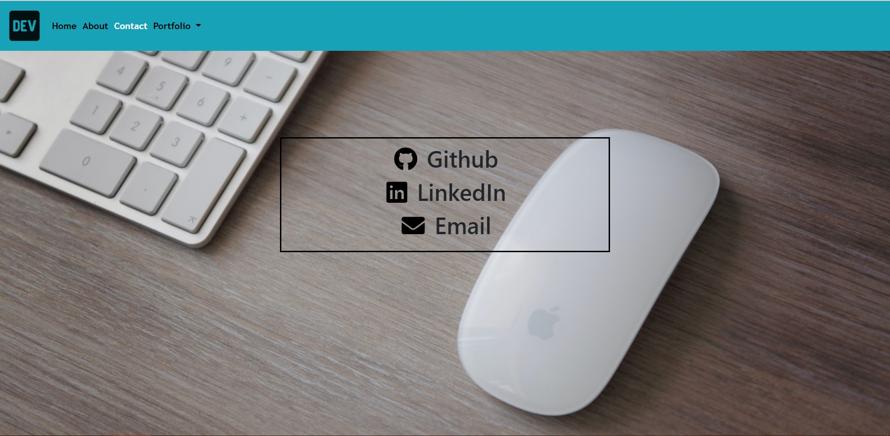

My Portfolio

With more practice, skills and a better understanding of web development can be obtained. Taking these skills and languages can be applied to an updated portfolio to being employer-competitive. Utilizing a portfolio will provide a place to share projects and skills neccessary for the journey to becoming a developer.

Inside this portfolio is:

1. A description about myself and downloadable resume

2. Contact information to my LinkedIn and Github profiles as well as email.

3. A portfolio section containing deployed projects

4. A web application focused on a mobile-responsive interface

Visit my portfolio with the links provided:

[Portfolio](https://jkeopangna.github.io/updatedPortfolio/)
